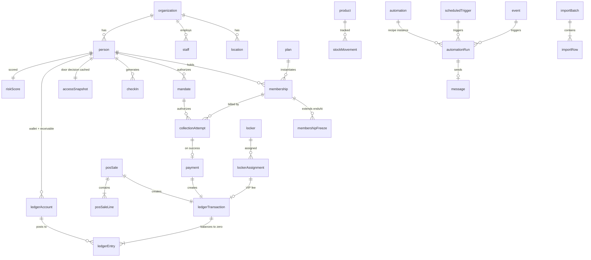

# GymOS — Domain Model

Companion to `schema.ts`. This document explains *why* the model is shaped this
way, proves it works against real Iranian gym scenarios, and lists what still
needs your decision.

Scoped for a **solo build with no legal entity yet**. Direct-debit tables are
present but unbuilt — see §7.

---

## 1. The eight load-bearing decisions

| # | Decision | Why | Cost if wrong |
|---|---|---|---|
| 1 | **Money is integer Rial** | PSPs, banks, invoices and سامانه مودیان all speak Rial. Toman is display-only (÷10). | Float rounding in a financial ledger is unrecoverable. Toman storage means converting at every PSP boundary. |
| 2 | **No stored balances — double-entry ledger** | Arrears, wallet, cash drawer, trainer payable and buffet credit are the *same* mechanism. One implementation, four features. | Four divergent balance columns that disagree. This is the classic gym-software bug: the debt column doesn't match the payments. |
| 3 | **One `person` table, not lead + member** | A lapsed member *is* a win-back lead. Conversion preserves first-touch attribution. | Conversion becomes a copy; you lose the lifecycle spine the whole strategy rests on. |
| 4 | **`mandate` separate from `membership`** | A membership is what they bought; a mandate is standing authority to collect. One member may have several memberships under one mandate, or a mandate and no active membership. | The wedge becomes unbuildable without a migration that touches every row. |
| 5 | **Facts are append-only** (`checkIn`, `ledgerEntry`, `collectionAttempt`, `membershipFreeze`, `stockMovement`) | Offline sync can't conflict on an append. Financial corrections are reversing entries, not edits. | Offline check-in becomes a merge-conflict problem with no correct answer. Audit trail becomes unprovable. |
| 6 | **`accessSnapshot` precomputes the door decision** | The terminal must decide admission with no network. Only possible if the answer is already computed. | "Offline support" that silently requires the server — i.e. fake. Front desk dies during an outage and the gym returns the product. |
| 7 | **Two trigger sources: `event` + `scheduledTrigger`** | "Checked in" is reactive; "expires in 7 days" is proactive. Materialise fire times on write. | Nightly full-table scans that don't scale and miss edits between runs. |
| 8 | **`jalaliYm` denormalised on transactional tables** | Every report groups by Jalali month. Computing it per query is slow and error-prone (variable month lengths, Nowruz year boundary). | Every revenue report is subtly wrong at month boundaries. |

### Also non-negotiable

- **Week starts Saturday.** Silently breaks every "this week" query and weekly chart if you take the JS default.
- **Timestamps are `timestamptz` UTC**; Jalali is presentation + bucketing only.
- **Holidays are a table**, not a constant — Iranian official holidays are irregular and announced.
- **`org_id` on every tenant table, RLS enforced.** Defence in depth; don't rely on application filtering alone.
- **The ledger balance constraint belongs in the database.** A deferred constraint trigger asserting `sum(debits) = sum(credits)` per transaction. Do not trust application code.

---

## 2. Entity map

---

## 3. Worked example — a membership sale with partial payment

The most common Iranian case: member buys a 2,500,000 Toman month, pays
1,500,000 in cash, owes the rest. This is *one* transaction.

**Sale** — `ledgerTransaction(type='membership_sale')`

| Account | Direction | Rial |
|---|---|---|
| `member_receivable` (this person) | debit | 25,000,000 |
| `revenue_tuition` | credit | 25,000,000 |

**Payment** — `ledgerTransaction(type='payment')`

| Account | Direction | Rial |
|---|---|---|
| `cash_drawer` (this location) | debit | 15,000,000 |
| `member_receivable` (this person) | credit | 15,000,000 |

Their arrears is now the balance of their receivable account: **10,000,000 Rial
(1,000,000 Toman)**. Nothing stores that number. It is derived, always correct,
and always reconcilable against the cash drawer.

When direct debit lands in V1, a successful `collectionAttempt` produces the
*identical* second transaction with `bank` instead of `cash_drawer`. **The
arrears feature needs no changes at all to gain a payment rail** — which is
exactly why the schema is worth getting right now, while you can't yet build it.

---

## 4. Worked example — offline check-in

1. Kiosk holds `accessSnapshot` rows in IndexedDB for every active person at
   its location. Refreshed every ~5 min while online.
2. Member scans. Kiosk reads `canEnter`, `reasonCode`, `sessionsRemaining`,
   `arrearsRial` **locally**. Decision is instant and needs no network.
3. Kiosk appends a `checkIn` to a local outbox with a generated `clientEventId`.
4. On reconnect, outbox flushes. `checkIn_client_event_uq` makes replay a no-op.
5. Server recomputes the snapshot (session consumed, possibly now expired) and
   pushes the delta back.

**Why it can't conflict:** a check-in is a historical fact, not a mutation. Two
terminals recording the same person is a duplicate suppressed by the unique key,
not a merge conflict.

**Accepted trade-off:** a member who pays their arrears at the desk while a
kiosk is offline may be refused for up to the snapshot staleness window. Make
`validUntil` short (~15 min) and let staff override manually — record the
override as `method='manual'` with the staff id. Do not try to solve this
perfectly; it's rare and the manual path is the right answer.

---

## 5. Worked example — arrears recovery (your launch wedge)

This is the feature that sells the product, and it needs no PSP.

1. Nightly job recomputes `riskScore` for every active person.
2. A member with a receivable balance aged >7 days gets
   `reasons: [{code:'arrears', detail:'owes 4,200,000 rial for 23 days'}]`.
3. `automation(recipeKey='arrears_reminder')`, if enabled, creates an
   `automationRun` with an idempotency key of
   `arrears:{personId}:{jalaliYm}:{bucket}` — so it fires once per member per
   month per aging bucket, never twice, even if the job reruns.
4. Run emits a `message` with its own idempotency key. Provider retries can't
   double-send.
5. Owner dashboard shows: **total arrears outstanding, aged**, and **amount
   recovered since automation was enabled**.

That last number is the entire sales pitch, and it's computable from the ledger
on day one.

---

## 6. What is deliberately NOT modelled

| Omitted | Why |
|---|---|
| Booking / classes / waitlist | V1. Open-floor market; demoted per the strategy. |
| Workout & nutrition programs | V1 — and consider partnering with IranBadan/Gymina rather than building. |
| Statutory payroll | Cut. Trainer commission only, and that's V1. |
| Invoices / مودیان | V2, and only if the obligation is confirmed to bind gyms at this revenue scale. |
| Website, reviews, dynamic pricing, marketplace | Cut entirely. |
| Vertical configurability | Schema is generic enough to support a pilates studio; do not *productize* that. |
| `Contract` | Modelled as a stub only. Low enforcement value in Iran. |

---

## 7. Direct debit: present but dormant

`mandate` and `collectionAttempt` ship in the first migration with no code
behind them. Reasons:

- Adding them later means a migration that touches `payment` and `membership` —
  exactly the tables with the most rows and the most risk.
- Zero cost to carry two unused tables.
- When the entity and PSP contract land, the work is a worker + a mandate-capture
  screen. Nothing already built has to change.

**Do not build any of it until the PSP call confirms eligibility.**

---

## 8. Open questions — these need your answer

1. **Session-count semantics.** When a 12-session membership is bought on
   `۱۴۰۵/۰۷/۰۱`, do unused sessions expire at month end, or roll over? Iranian
   gyms differ, and it changes `membership.endsAt` handling. *Ask your three
   design-partner gyms — don't guess.*
2. **Gendered time blocks.** Is this a property of the *location* (whole gym
   switches at 16:00), of the *plan*, or a schedule entity? Cheapest is a
   location-level schedule; confirm no target gym runs concurrent split halls.
3. **Multi-location members.** Can one member train at any branch, or are they
   bound to `homeLocationId`? Affects `accessSnapshot`'s primary key, which is
   currently `(personId, locationId)` — that already supports both, but the
   *business rule* needs deciding.
4. **Member identity.** Mobile is currently the unique key per org. Confirm no
   target gym has members sharing a family phone number — if they do, the
   uniqueness constraint has to move to `nationalId` or a synthetic key.
5. **Arrears and the door.** Does the gym want hard blocking, a warning, or a
   grace threshold in Rial? Make it configurable per org; default to warn, since
   hard-blocking a paying customer over 50,000 Rial generates angry phone calls.
6. **Trainer commission basis.** Percentage of *sold* tuition or *collected*
   tuition? In a market with endemic arrears these differ enormously, and
   trainers care. Collected is the honest answer and the ledger supports it.

---

## 9. Next artifacts, in order

1. **Migrations + RLS policies + the balance-constraint trigger** — this schema made real.
2. **Permission matrix** — receptionist is the primary user; design for them first.
3. **Recipe specs** — exact trigger, condition, copy and idempotency key for each of the 6 MVP automations.
4. **Migration extractor spec** — per incumbent file format, once the week-1 teardown says what's readable.
